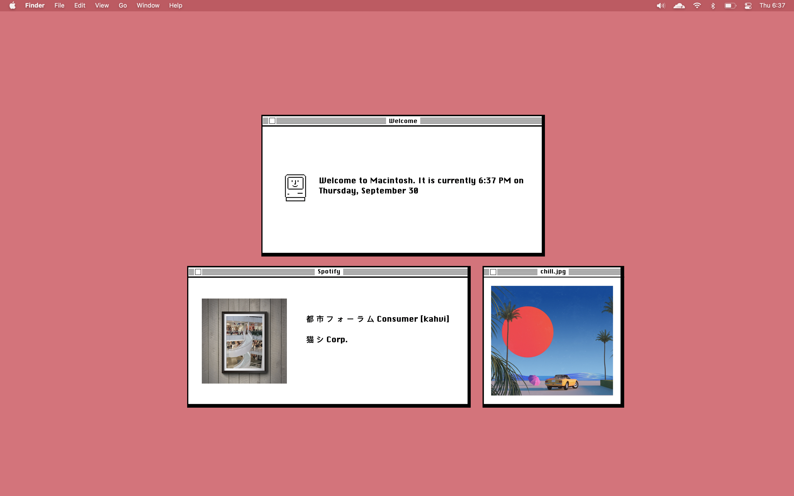

# Retro-Macintosh-Geektool-Setup

 A simple Geektool setup based on the original Macintosh's UI. The wallpaper in the screenshot is Apple's "Dusty Rose" wallpaper which you can find in the "Colors" folder of the desktop & screen saver system preferences. 

 The widget frames are just images that were made in Affinity Designer while using images of the Macintosh's UI as reference. 

 New tab extension is <a href="https://chrome.google.com/webstore/detail/focuso-new-tab-with-to-do/cmfhopmhaagcfnjflfppceclmkenjkpc?hl=en-US"> Focuso</a>. 

# Images used
- chill.png: https://www.hdwallpapers.in/yellow_car_pink_umbrella_and_palm_trees_hd_vaporwave-wallpapers.html
- chill2.png: https://www.pixiv.net/en/artworks/80828516
- weather_cloudy.png: https://www.pinterest.ph/pin/3307399717784190/
- weather_sunny.png: https://www.pinterest.ph/pin/571957221430728249/
- weather_rainy.png: https://www.pinterest.ph/pin/820147782155406932/
- weather_sunny2.png: Generated by DALL-E 3.
